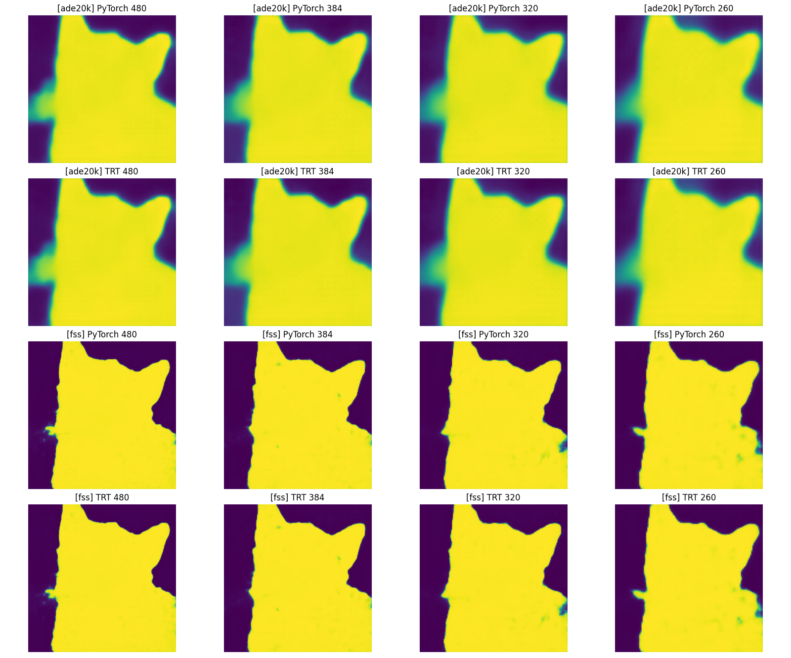

# LSeg Image Encoder ONNX & TensorRT

# *아직 작업중입니다! 완료되지 않았습니다!!!*

본 프로젝트는 **LSeg 모델의 이미지 인코딩 경로**(백본, 중간 feature 추출, projection layer)를 분리하여 **ONNX** 및 **TensorRT** 모델로 변환하고, 각 단계별 **Inference 성능 비교**를 지원합니다.

---

## Installation

### 1. Python 환경

* Python 3.8 이상 권장
* 가상환경(venv, conda 등) 사용을 권장합니다.

### 2. 필수 라이브러리 설치

```bash
pip install -r requirements.txt
```

### 3. 시스템 패키지 설치 (Ubuntu 예시)

```bash
sudo apt update && sudo apt install -y \
    python3-pip python3-dev \
    libopencv-dev \
    libprotobuf-dev protobuf-compiler \
    libtinfo5 \
    libopenmpi-dev \
    cuda-toolkit-##  # CUDA 설치 필요시 버전에 맞춰
```
### 4. C++ 벤치마크 빌드
Inference Time Test 용 C++ 프로그램 빌드
```bash
cd CPP_Project/Inference_Time_Tester
mkdir -p build && cd build
cmake ..
make -j$(nproc)
cd ../../../
```

### 5. C++ Feature Extractor 빌드

Feature Map 추출용 C++ 프로그램 빌드

```bash
cd CPP_Project/Feature_Extractor
mkdir -p build && cd build
cmake ..
make -j$(nproc)
cd ../../../
```

---

## 모델 다운로드

**Weight 파일**은 LSeg 공식 저장소에서 가져오세요.
LSeg 공식 저장소 : **[https://github.com/isl-org/lang-seg](https://github.com/isl-org/lang-seg)**

```bash
# 메인 ViT-L/16 모델 (demo_e200.ckpt)
pip install gdown
# demo_e200.ckpt 다운로드
gdown 'https://drive.google.com/uc?id=1FTuHY1xPUkM-5gaDtMfgCl3D0gR89WV7'

# FSS 데이터셋 기반 모델 예시
# fss_rn101.ckpt (ResNet101)
gdown 'https://drive.google.com/uc?id=1UIj49Wp1mAopPub5M6O4WW-Z79VB1bhw'
# fss_l16.ckpt (ViT-L/16)
gdown 'https://drive.google.com/uc?id=1Nplkc_JsHIS55d--K2vonOOC3HrppzYy'
```

다운로드한 체크포인트는 `models/weights/` 아래에 저장하세요.

---

## Project Structure

```
LSeg_Image_Encoder_TensorRT/
├── CPP_Project/                      # C++ 프로그램 모음
│   ├── Feature_Extractor/            # Feature 추출기 프로젝트
│   │   ├── CMakeLists.txt            # CMake 설정
│   │   └── main.cpp                  # Feature 추출기 메인 코드
│   ├── Inference_Time_Tester/        # Inference 벤치마크 프로젝트
│   │   ├── CMakeLists.txt            # CMake 설정
│   │   └── main.cpp                  # 벤치마크 메인 코드
│   └── third_party/                  # C++ 서드 파티
│       └── cnpy/                     # CNpy submodule for numpy I/O
├── Visual_Demo/                      # 데모 스크립트 및 결과
│   ├── demo.sh                       # demo.sh 스크립트
│   ├── demo.py                       # demo.py 호출 래퍼
│   ├── demo_wordFree.sh              # demo_wordFree.sh 스크립트
│   ├── demo_wordFree.py              # demo_wordFree.py 호출 래퍼
│   └── images/                       # 시각화 결과 및 입력 이미지
│       ├── Dog_grass_demo.png        # segmentation 결과 예시
│       ├── Dog_grass_wordFree.png    # word-free 결과 예시
│       └── dog_grass.jpeg            # 입력 이미지 예시
├── models/
│   ├── weights/
│   │   ├── demo_e200.ckpt # 예시: ViT-L/16 CLIP 모델 체크포인트
│   │   └── fss_l16.ckpt   # 예시: FSS 기반 ViT-L/16 모델 체크포인트
│   ├── onnx_engines/
│   │   ├── lseg_img_enc_vit_ade20k.onnx  # 예시 ONNX 모델
│   └── trt_engines/
│        │     # 예시 TRT 엔진
│        ├── lseg_img_enc_vit_ade20k__fp16_sparse_ws512MiB.trt 
│
├── modules/               # LSeg 모델 관련 소스
│   ├── lseg_module.py     # LSegModule: 이미지 인코더 + 헤드 래핑
│   ├── lseg_full.py       # LSegFull: 백본과 헤드 포함 전체 네트워크
│   ├── models/            # 내부 서브모듈
│   │   ├── lseg_blocks.py  # RefineNet 블록과 skip-connection 처리
│   │   ├── lseg_net.py     # 네트워크 assemble 유틸리티
│   │   └── lseg_vit.py     # CLIP ViT 레이어 분할 및 feature 추출
│
├── conversion/
│   ├── model_to_onnx.py   # PyTorch → ONNX 변환 스크립트
│   ├── onnx_to_trt.py     # ONNX → TensorRT 변환 스크립트
│   └── onnx_to_trt.sh     # 쉘 래퍼 스크립트
│
├── CPP_Project/
│   └── Inference_Time_Tester/      # C++ 벤치마크 프로젝트
│       ├── CMakeLists.txt          # CMake 설정
│       ├── main.cpp                # 벤치마크 메인 코드
│       └── build/                  # 빌드 결과물 (trt_cpp_infer_time_tester 실행파일)
│
├── python_trt_comp/                  # Python 기반 Feature 비교 스크립트
│   ├── compare_features.py           # Feature map 비교 (Cosine/L2)
│   ├── compare_inputs.py             # 입력 tensor 비교
│   ├── model_output.py               # PyTorch Feature 추출 스크립트
│   └── run_feature_comparison.sh     # 전체 파이프라인 실행 스크립트
│
├── inferenceTimeTester.py # 추론 및 벤치마크 메인 스크립트 (루트 폴더)
│
├── requirements.txt       # Python 패키지 목록
└── README.md              # 본 파일
```

## Usage

### 1. ONNX 모델 변환

```bash
python3 conversion/model_to_onnx.py \
  --weights models/weights/demo_e200.ckpt \
```

* `--weights`: 체크포인트 경로

### 2. TensorRT 엔진 변환
**주의**: TensorRT 변환은 GPU 및 환경에 따라 다르므로, **실행할 기기에서 직접 변환**해야 합니다.
```bash
python3 conversion/onnx_to_trt.py \
  --onnx models/onnx_engines/lseg_img_enc_vit_ade20k.onnx \
  --workspace 1073741824 \
  --fp16 \
  --sparse \
  --disable-timing-cache \
  --gpu-fallback \
  --debug 
```

#### TensorRT 옵션 설명

| 옵션                         | 종류      | 기본값     | 설명                           |
| -------------------------- | ------- | ------- | ---------------------------- |
| `--onnx <PATH>`            | 필수    | —      | 입력 ONNX 파일 경로                |
| `--workspace <BYTE>`       | integer | `1<<29` | 빌더 워크스페이스 메모리(바이트)           |
| `--fp16` / `--no-fp16`     | flag    |  true   | FP16 연산 사용 여부                |
| `--sparse` / `--no-sparse` | flag    |  true   | Sparse weights 전술 사용 여부      |
| `--disable-timing-cache`   | flag    | false   | 타이밍 캐시 비활성화 (빌드 안정성 ↑, 속도 ↓) |
| `--gpu-fallback`           | flag    | false   | INT8 모드에서 GPU 연산 폴백 허용       |
| `--debug`                  | flag    | false   | 디버그 로그 활성화                   |

**엔진 파일명 자동 생성 규칙**: `base__<옵션1>_<옵션2>_..._<wsXXMiB>.trt`

---

### 3. Inference & Benchmark

`inference/inferenceTimeTester.py` 를 실행하여 **PyTorch, ONNX, TensorRT** 속도를 비교합니다.

```bash
python3 inference/inferenceTimeTester.py \
  --weights models/weights/demo_e200.ckpt \
  --iterations 500 \
  --img_sizes 260 390 520 650 780 910 \
  --trt_fp16 \
  --trt_sparse \
  --trt_no_tc \
  --trt_gpu_fb \
  --trt_debug \
  --trt_workspace 1073741824
```

* `--img_sizes`: 테스트할 입력 크기 목록
* `--iterations`: 반복 횟수
* `--trt_*`: TRT 빌드 옵션 (ONNX→TRT에 자동 반영)

**스크립트 동작**:

1. ONNX 파일이 없으면 자동 생성
2. TRT 엔진이 없으면 자동 생성
3. PyTorch → ONNX → TRT 순으로 추론 벤치마크

**결과 예시**:

```
[RESULT] PyTorch Avg: 12.345 ms ± 0.123 ms
[RESULT] ONNX   Avg: 10.567 ms ± 0.098 ms
[RESULT] TRT    Avg:  5.432 ms ± 0.045 ms
```

---

### 4. Demo Scripts

### Visual_Demo/demo.sh

이 스크립트는 **ONNX 모델**을 이용해 예시 이미지를 분할(segmentation)하고, 결과를 시각화합니다.

```bash
# 사용 예시 (루트에서 실행)
python3 Visual_Demo/demo.py --image Visual_Demo/images/dog_grass.jpeg \
                            --labels "dog, grass, other" \
                            --onnx models/onnx_engines/lseg_img_enc_vit_ade20k.onnx \
                            --size 384
```

* `--image`: 입력 이미지 경로
* `--labels`: 콤마(,)로 구분된 라벨 목록 (예: "cat, sky, building")
* `--onnx`: ONNX 모델 파일 경로
* `--size`: 모델 입력 크기 (HxW)

스크립트 내부에서는 `demo.py` 를 호출하며, 좌측에 원본 이미지, 우측에 segmentation 결과를 출력합니다.


### Visual_Demo/demo\_wordFree.sh

이 스크립트는 **Full CLIP Vocab 기반** 픽셀 단위 분류를 수행하고, **등장한 단어**를 콘솔에 출력하며 시각화합니다.

```bash
# 사용 예시 (루트에서 실행)
python3 Visual_Demo/demo_wordFree.py --image Visual_Demo/images/dog_grass.jpeg \
                                     --onnx models/onnx_engines/lseg_img_enc_vit_ade20k.onnx \
                                     --size 384
```

* `--image`: 입력 이미지 경로
* `--onnx`: ONNX 모델 파일 경로
* `--size`: 모델 입력 크기 (HxW)

스크립트 내부에서는 `demo_wordFree.py` 를 호출하여 이미지 내 픽셀마다 CLIP 전체 vocab 중 가장 유사도가 높은 토큰을 선택, 해당 단어들을 출력하고 결과를 시각화합니다.

### Visual Results

아래는 `Visual_demo/images/` 폴더에 저장된 예시 결과입니다:

|                     Segmentation (`demo.py`)                     |                  Word-free (`demo_wordFree.py`)                  |      |
| :--------------------------------------------------------------: | :--------------------------------------------------------------: | ---- |
|  |  |


---

### 5. Feature Comparison & Extraction

전체 Feature 추출 및 비교 파이프라인 실행:

```bash
bash python_trt_comp/run_feature_comparison.sh
```

* `run_feature_comparison.sh`: `model_output.py`, C++ Feature Extractor, `compare_features.py` 순차 실행
* 결과는 `outputs/` 폴더와 콘솔 로그로 확인합니다.

### Visual Results

아래는 `Visual_demo/images/` 폴더에 저장된 예시 결과입니다:

---


## Additional Notes

* **ONNX opset\_version=14** 사용
* 동적 입력 크기 지원: `torch.onnx.export(... dynamic_axes=...)` 설정 참조
* GPU 벤치마크를 위해 `onnxruntime-gpu` 필요: `pip install onnxruntime-gpu`
* CUDAExecutionProvider 확인:

```python
import onnxruntime as ort
print(ort.get_available_providers())
```

---

## License

사용 중인 라이선스를 명시하세요. 예: MIT License
